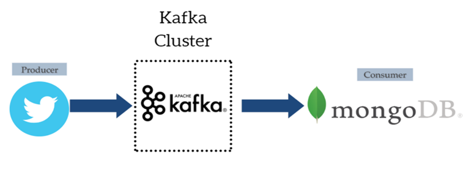

 <h1 align="center">Twitter streams with apache kafka</h1>

I've used Twitter API to get real time tweet streams in an application that will put the data into Apache Kafka, then these tweets end up in MongoDB collection at the end.

## The project consists of two main parts:
- **Kafka Producer:** the role of this part is to get the tweets from twitter using twitter API, then put these tweets into Apache kafka. Click [here](/Kafka_producer_twitter/kafkaProducer/twitterProducer.java) to go to this part code. You can find dependencies used in this part [here](/Kafka_producer_twitter/pom.xml)
- **Kafka Consumer:** the consumer first gets the tweets from apache kafka and stores them in MongoDB database. Click [here](/Kafka_consumer_mongoDB/kafkaConsumer/mongodbConsumer.java) to go to this part code. You can find dependencies used in this part [here](/Kafka_consumer_mongoDB/pom.xml)

## Tools and technologies used in this project:
Java, Apache Kafka, MongoDB and Twitter API.
